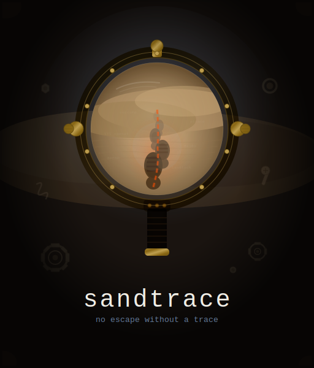

<p align="center">
  
  <br>
  <em>No escape without a trace.</em>
</p>

# sandtrace

A lightweight Rust tool that traces syscalls while confining processes to a strict sandbox — strace meets secure containment.

Built for security researchers, malware analysts, and developers who need to safely observe untrusted code.

## How It Works

sandtrace forks a child process, wraps it in 8 independent isolation layers, then traces every syscall it makes via ptrace. Policy rules decide what gets allowed, denied, or logged. All activity is emitted as structured JSONL.

```
Binary under test
       |
       v
 +--------------------------+
 | User namespace           |  UID/GID isolation
 | Mount namespace          |  Minimal fs (tmpfs /tmp, private /dev)
 | PID namespace            |  Host processes hidden
 | IPC / UTS / Cgroup ns    |  Full IPC + hostname isolation
 | Network namespace        |  No network (loopback only)
 | Landlock LSM             |  Kernel-enforced filesystem ACLs
 | seccomp-bpf              |  Dangerous syscall blocking + W^X
 | ptrace                   |  Real-time tracing + policy enforcement
 +--------------------------+
       |
       v
  JSONL output (every syscall, process event, summary)
```

Any single layer failing does not grant full access. Even if ptrace misses a syscall, Landlock blocks unauthorized filesystem access and seccomp blocks dangerous syscalls.

## Build

```bash
cargo build --release
# Binary: target/release/sandtrace (2.3MB)
```

Requires Linux 5.13+ (for Landlock). No runtime dependencies.

## Quick Start

```bash
# Trace what a binary does (observe only, no enforcement)
sandtrace run --trace-only -vv ./suspicious_binary

# Full sandbox with default restrictive policy
sandtrace run ./suspicious_binary

# Allow network access
sandtrace run --allow-net curl https://example.com

# Allow specific filesystem paths
sandtrace run --allow-path ./project -o trace.jsonl npm install

# Use a policy file
sandtrace run --policy examples/strict.toml ./untrusted_elf

# Timeout after 10 seconds
sandtrace run --timeout 10 ./slow_binary
```

## CLI Reference

```
sandtrace run [OPTIONS] <COMMAND> [ARGS...]
```

| Flag | Default | Description |
|------|---------|-------------|
| `--policy <FILE>` | built-in restrictive | TOML policy file |
| `--allow-path <PATH>` | none | Allow read+write to path (repeatable) |
| `--allow-net` | false | Allow network access |
| `--allow-exec` | false | Allow child process execution |
| `-o, --output <FILE>` | stdout | JSONL output file |
| `--no-color` | false | Disable colored terminal output |
| `--timeout <SECS>` | 30 | Kill process after N seconds |
| `-v, --verbose` | 0 | Increase verbosity (-v, -vv, -vvv) |
| `--trace-only` | false | Disable enforcement, just trace |
| `--follow-forks` | true | Trace child processes |

## Output

### Terminal (stderr)

Colored human-readable output at configurable verbosity:

```
17:30:28.851 ALLOW [12345] openat [file_read] {path: "/usr/lib/libc.so.6", flags: "O_RDONLY|O_CLOEXEC"} = 3
17:30:28.852 DENY  [12345] openat [file_read] {path: "/etc/shadow", flags: "O_RDONLY"} = -1
17:30:28.853 ALLOW [12345] mmap [memory] {prot: "PROT_READ|PROT_EXEC", length: "1605632"} = 0x7f...
```

### JSONL (stdout or file)

One JSON object per line — every syscall, process event, and a final summary:

```json
{"event_type":"syscall","pid":12345,"syscall":"openat","args":{"decoded":{"path":"/etc/shadow","flags":"O_RDONLY"}},"action":"deny","return_value":-1}
{"event_type":"process","pid":12345,"kind":{"type":"exit","code":1}}
{"event_type":"summary","total_syscalls":4523,"denied_count":3,"files_accessed":[...],"files_created":[...],"files_deleted":[...],"network_attempts":[...],"suspicious_activity":[...]}
```

Parseable by `jq`, Python, or any SIEM.

## Policy Files

Policies are TOML files that control what the sandboxed process can do:

```toml
[filesystem]
allow_read = ["/usr", "/lib", "/lib64", "/etc/ld.so.cache", "/dev/null", "/dev/urandom", "/proc/self"]
allow_write = []
allow_exec = []
deny = ["/home/*/.ssh", "/etc/shadow", "**/.env"]

[network]
allow = false

[syscalls]
deny = ["mount", "ptrace", "kexec_load", "reboot"]
log_only = ["mprotect", "mmap"]

[limits]
timeout = 30
max_processes = 10
max_file_size = "10M"
max_open_files = 256
memory_deny_write_execute = true
```

### Included examples

| File | Use case |
|------|----------|
| `examples/strict.toml` | Maximum lockdown — read-only standard libs, no network, no exec |
| `examples/permissive.toml` | Observe everything, block only truly dangerous syscalls |
| `examples/npm_audit.toml` | Audit `npm install` — allow network + node_modules writes, deny SSH/env |

### Default policy (no `--policy` flag)

- Read-only access to `/usr`, `/lib`, `/lib64`, standard device nodes, `/proc/self`
- No write access, no exec
- Deny `/home/*/.ssh`, `/etc/shadow`, `**/.env`
- Network denied
- Block `mount`, `ptrace`, `kexec_*`, `reboot`, `init_module`, `pivot_root`
- W^X enforcement (block mprotect/mmap with PROT_WRITE|PROT_EXEC)
- 30-second timeout

## Security Layers

| Layer | Mechanism | Protects Against |
|-------|-----------|-----------------|
| User namespace | `CLONE_NEWUSER` | UID/GID escalation |
| Mount namespace | `CLONE_NEWNS` + tmpfs + private /dev | Host filesystem access |
| PID namespace | `CLONE_NEWPID` | Host process enumeration |
| IPC namespace | `CLONE_NEWIPC` | Shared memory / semaphore attacks |
| UTS namespace | `CLONE_NEWUTS` | Hostname fingerprinting |
| Cgroup namespace | `CLONE_NEWCGROUP` | Cgroup escape |
| Network namespace | `CLONE_NEWNET` | Network exfiltration |
| PR_SET_NO_NEW_PRIVS | `prctl()` | setuid/setgid escalation |
| Capability drop | `PR_CAPBSET_DROP` | Capability abuse |
| Landlock LSM | Kernel filesystem ACLs | File access beyond allowed paths |
| seccomp-bpf | `SECCOMP_RET_TRAP` | Dangerous syscalls |
| W^X enforcement | seccomp argument filtering | Self-modifying code / JIT shellcode |
| rlimits | `setrlimit()` | Fork bombs, disk filling, fd exhaustion |
| ptrace | `PTRACE_TRACESYSGOOD` | Real-time observation + denial |

## Filesystem Diff Tracking

The summary includes filesystem mutations observed during the trace:

- **files_created** — `openat` with `O_CREAT`, `mkdir`, `symlink`, `link`
- **files_modified** — `openat` with `O_WRONLY`/`O_RDWR`/`O_TRUNC`, `truncate`
- **files_deleted** — `unlink`, `rmdir`, `rename` (source)

## Testing

```bash
# Unit tests (116)
cargo test --bin sandtrace

# Integration tests (16)
cargo test --test integration

# All tests
cargo test
```

## Architecture

| x86_64 | aarch64 |
|--------|---------|
| `PTRACE_GETREGS` | `PTRACE_GETREGSET` + NT_PRSTATUS |
| `orig_rax` for syscall nr | `regs[8]` (x8) |
| Full syscall table | Full syscall table |

## Part of Shai-Hulud Scanner

sandtrace is one tool in the [shai-hulud-scanner](../README.md) suite:

| Tool | Approach | Use case |
|------|----------|----------|
| `detect-config-malware.sh` | Static (git history) | Deep repo audit |
| `sandworm` | Static (filesystem) | Quick broad sweep |
| **`sandtrace`** | Dynamic (runtime sandbox) | Run and analyze suspicious binaries |

## License

MIT
